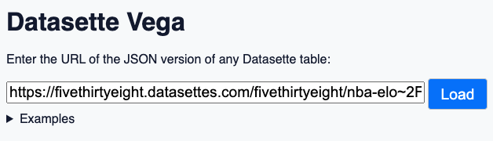
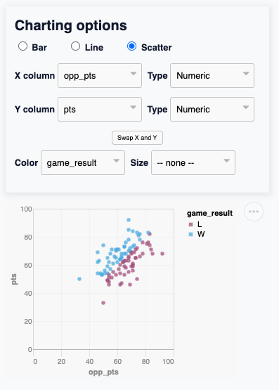

# datasette-vega

[](https://pypi.org/project/datasette-vega/)
[](https://github.com/simonw/datasette-vega/blob/master/LICENSE)

A [Datasette](https://github.com/simonw/datasette) plugin that provides tools
for generating charts using [Vega](https://vega.github.io/).


Try out the latest master build as a live demo at https://datasette-vega-latest.datasette.io/ or try the latest release installed as a plugin at https://fivethirtyeight.datasettes.com/

To add this to your Datasette installation, install the plugin like so:

```bash
pip install datasette-vega
```

The plugin will then add itself to every Datasette [table] and [database query] view.

If you are publishing data using the `datasette publish` command, you can
include this plugin like so:

```bash
datasette publish vercel mydatabase.db --install=datasette-vega
```
(see [`datasette-publish-vercel`])

## Development

To contribute to this tool, first checkout the code:
```bash
git clone git@github.com:simonw/datasette-vega.git
```

Then, install dependencies:
```bash
npm install
```

### "Dev" mode demo
Then, you will be able to run a hot-reloading development server:
```bash
npm start
```

### "Prod" mode demo
You can build static assets for distribution with:
```bash
npm run build
```

You'll find the built assets in the `build/` directory, and can serve them with:
```bash
npm install -g serve  # if you don't already have `serve` installed
serve -s build
```

`serve` will copy a URL to your clipboard, which you can then paste into your browser:


Try expanding "Examples" and checking out some sample charts:


### Plugin build
To build the plugin, run:
```bash
python setup.py bdist_wheel
```

This will run the `npm run build` command and move the built assets into `datasette_vega/static/`, where they will be included in the plugin's Python package.

### Testing plugin
You can install your own fork of this repo into your Datasette environment like so:
```bash
GITHUB_USER=YOUR_GITHUB_USERNAME
datasette install 'datasette-vega @ git+https://github.com/${GITHUB_USER}/datasette-vega'
```

If in doubt, the GitHub Actions configs in [.github/workflows/](.github/workflows/) are a good place to look for how to run tests and build the plugin.

[table]: https://github.com/simonw/datasette/blob/0.64.3/datasette/views/table.py
[database query]: https://github.com/simonw/datasette/blob/0.64.3/datasette/views/database.py#L56-L61
[`datasette-publish-vercel`]: https://github.com/simonw/datasette-publish-vercel
