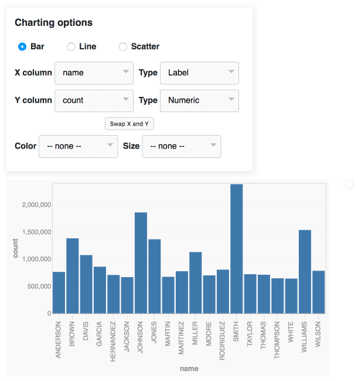

# datasette-vega

A [Datasette](https://github.com/simonw/datasette) plugin that provides tools
for generating charts using [Vega](https://vega.github.io/).

Try out the latest master build as a live demo at https://datasette-vega-latest.datasette.io/ or try the latest release installed as a plugin at https://fivethirtyeight.datasettes.com/

To add this to your Datasette installation, install the plugin like so:

    pip install datasette-vega

The plugin will then add itself to every Datasette table view.

If you are publishing data using the `datasette publish` command, you can
include this plugin like so:

    datasette publish now mydatabase.db --install=datasette-vega

If you don't want to install any software at all, you can publish your CSV files with Datasette and activate this plugin using the web application at https://publish.datasettes.com/
